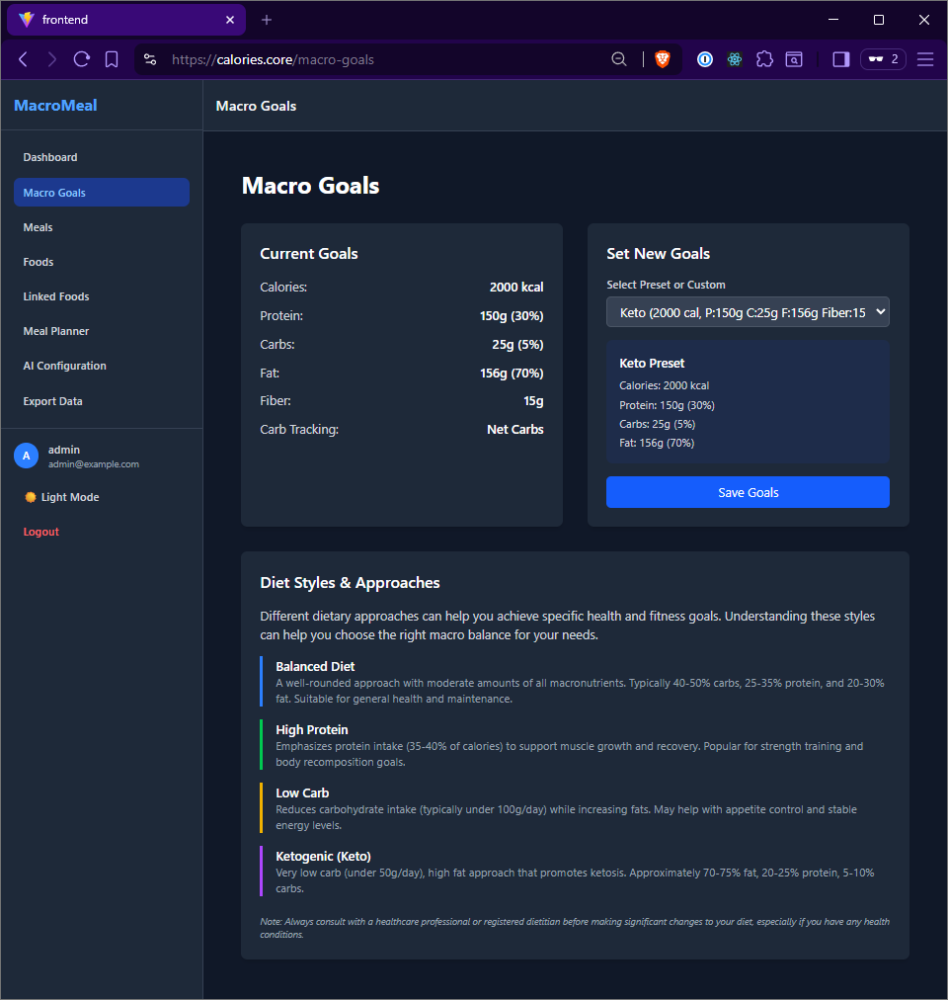
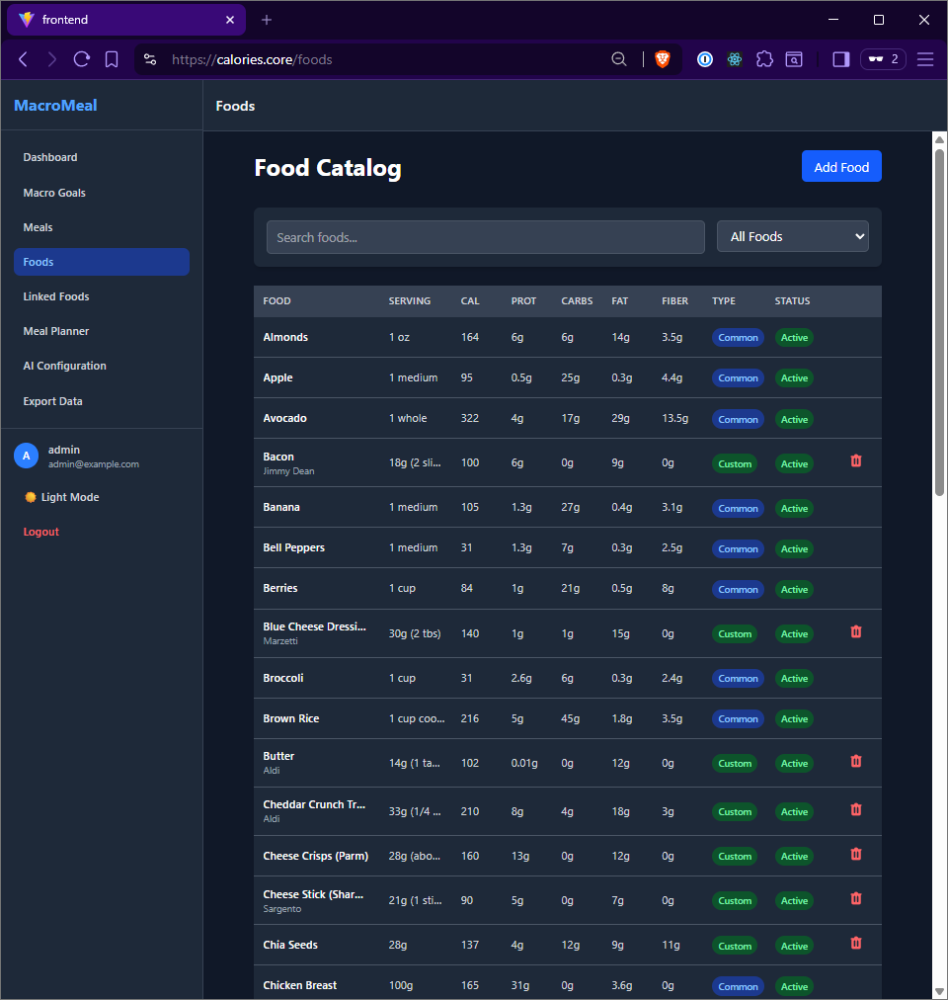
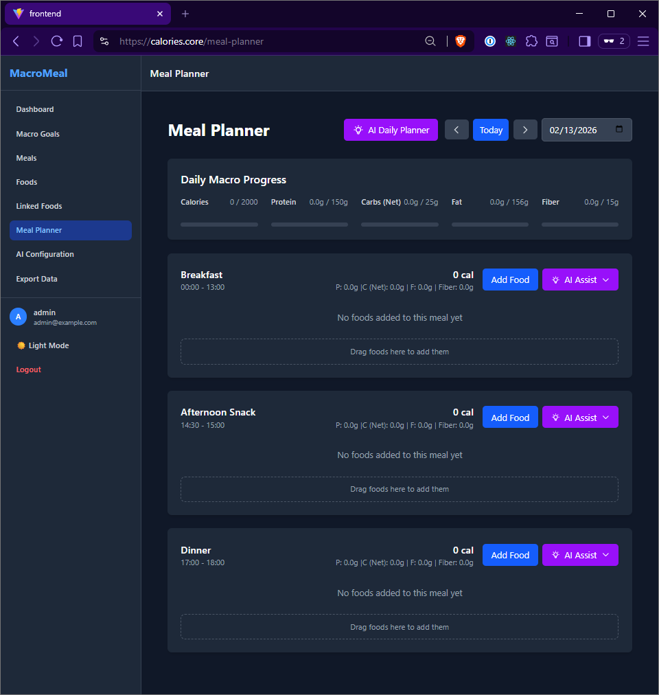
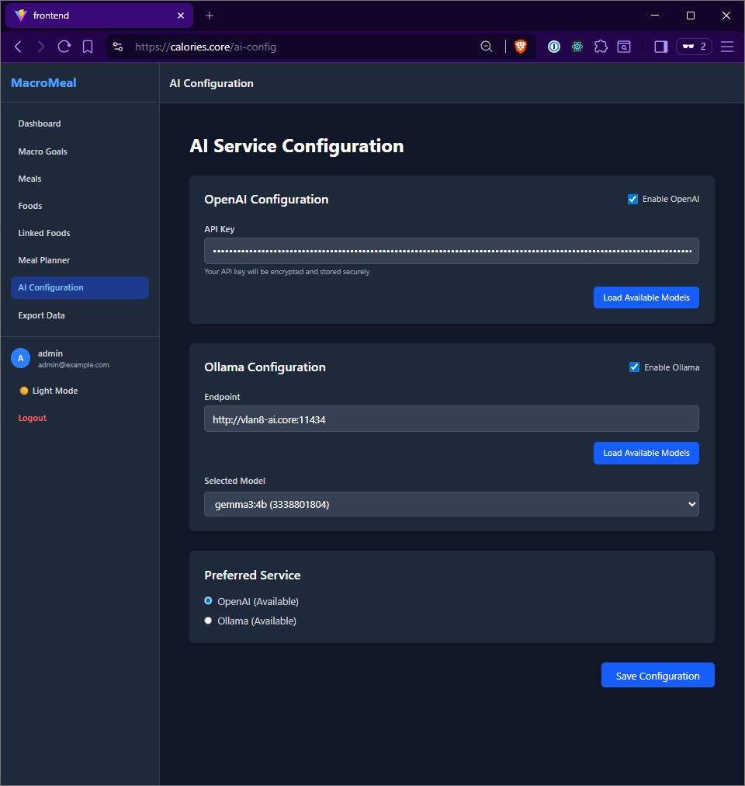

# Macro Meal Planner - AI-Powered Nutrition Tracking

A comprehensive meal planning application with AI-powered food analysis and macro tracking. Built with a React frontend and Node.js/Express backend.

## 🎯 Features Implemented

### Backend

- **Express.js API Server** with comprehensive REST endpoints
- **SQLite Database** with proper schema for users, meals, foods, and meal plans
- **JWT Authentication** with secure password hashing
- **Database Initialization** with sample foods and admin user
- **Environment Configuration** with proper security practices

### Frontend

- **React + Vite** setup with modern tooling
- **Responsive Design** with Tailwind CSS (mobile-first approach)
- **Dark/Light Theme** with system preference detection
- **Authentication System** with context-based state management
- **Routing & Navigation** with React Router
- **UI Component Library** with reusable components

### User Management

- **User Registration** with form validation
- **Login/Logout** with JWT token management
- **Password Reset** (console-based temporary passwords)
- **Session Management** with automatic token refresh
- **User Profile** with customizable preferences

### Macro Goals & Meal Configuration



- Macro goal setup interface (calories, protein, carbs, fat ratios for diets or custom )
- Eating window configuration
- Meal timing and percentage allocation

### Food Catalog System



- Photo analysis of nutrition label (OpenAI/Ollama)
- Advanced search and filtering

### Meal Planning Interface



- Drag-and-drop meal planning
- Real-time macro tracking
- Copy week functionality

### AI Integration



- OpenAI and Ollama support
- Meal suggestion system based on ingredients on hand and preferences
- Nutrition optimization

## 🛠️ Tech Stack

### Backend

- **Node.js** + **Express.js** - Server framework
- **SQLite3** - Database
- **bcryptjs** - Password hashing
- **jsonwebtoken** - Authentication
- **cors** - Cross-origin resource sharing
- **helmet** - Security headers

### Frontend

- **React 18** - UI framework
- **Vite** - Build tool
- **React Router** - Navigation
- **Tailwind CSS** - Styling
- **Axios** - HTTP client
- **React Context** - State management

## 📱 Responsive Design

The application features a fully responsive design:

- **Mobile**: Touch-optimized interface with drawer navigation
- **Tablet**: Adaptive layouts with gesture support
- **Desktop**: Full-featured interface with sidebar navigation

## 🎨 Theme System

- **Light/Dark modes** with smooth transitions
- **System preference detection** (auto mode)
- **Persistent theme storage** in localStorage
- **Accessible color contrasts** meeting WCAG standards

## 🔐 Security Features

- **JWT-based authentication** with expiration
- **Password hashing** with bcrypt
- **CORS configuration** for cross-origin requests
- **Rate limiting** for API endpoints
- **Input validation** and sanitization
- **SQL injection prevention** with parameterized queries

## 🗄️ Database Schema

### Users

- Authentication and profile data
- Role-based access control
- Session management

### Foods

- Common foods database (shared)
- Personal food catalog
- Complete US nutrition label fields
- AI estimation capabilities

### Meal Plans

- Weekly meal planning
- Macro tracking per meal
- Food quantity management
- Progress visualization

## 🚀 Getting Started

### Prerequisites

- Node.js 16+
- npm or yarn

### Backend Setup

```bash
cd backend
npm install
npm run dev
```

### Frontend Setup

```bash
cd frontend  
npm install
npm run dev
```

### Environment Variables

Copy `.env.example` to `.env` and configure:

- Database paths
- JWT secrets
- API endpoints
- Theme preferences

## 📄 API Endpoints

### Authentication

- `POST /api/auth/register` - User registration
- `POST /api/auth/login` - User login
- `GET /api/auth/me` - Get current user

### Profile

- `GET /api/profile` - Get user profile
- `PUT /api/profile` - Update profile

### Foods

- `GET /api/foods/common` - Get common foods
- `GET /api/foods/user` - Get user foods

### Health Check

- `GET /health` - Server status

## 🧪 Demo Accounts

### Admin Account

- **Username**: admin
- **Password**: admin123

### Test Account

- **Username**: testuser
- **Password**: password123

## 🎯 Next Development Phases

The foundation is complete and ready for advanced features:

## 🤝 Contributing

1. Fork the repository
2. Create a feature branch
3. Make your changes
4. Add tests if applicable
5. Submit a pull request

## 📝 License

This project is licensed under the ISC License.

## 🙏 Acknowledgments

- Built with modern web technologies
- Inspired by nutrition tracking best practices
- Designed with user experience in mind
